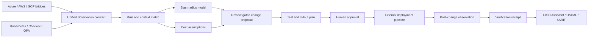

# Multi-Cloud Infrastructure Control Loop

A deterministic remediation compiler for Azure, AWS, Google Cloud, Kubernetes and Infrastructure as Code. It transforms normalized findings into cost-aware, blast-radius-scored, review-gated change proposals—and verifies whether the deployed state actually satisfied the intended control.

> The product is not “AI fixes cloud security.” It is an auditable decision envelope that tells an engineer what change is proposed, what it may cost, what it may break, what must be tested, and what evidence will prove the outcome.

## Five executable workflows

| Workflow | Proposed change | Required proof |
|---|---|---|
| Azure Storage public access | Private access and Private DNS design | Approved connectivity tests and post-change policy result |
| AWS S3 public exposure | Account/bucket public-access controls | Intended-public-content review and Security Hub recollection |
| GCP public bucket | Public Access Prevention and IAM review | Consumer-path validation and SCC recollection |
| Kubernetes privileged workload | Security context and admission policy | Workload tests and admission/runtime evidence |
| Cloud logging disabled | Provider-native log pipeline | Ingestion test, retention check and measured cost |



## Run locally

Python 3.11+ with no runtime dependencies:

```bash
python3 -m venv .venv
source .venv/bin/activate
python -m pip install -e .

control-loop compile \
  --input examples/azure-storage-public.json \
  --rules config/rules.json \
  --output generated/azure-storage-public

control-loop verify \
  --proposal generated/azure-storage-public/proposal.json \
  --post-change examples/azure-storage-remediated.json \
  --output generated/azure-storage-public/verification.json
```

Run all workflows and tests:

```bash
bash scripts/validate.sh
```

## Outputs

Each compilation produces:

- `proposal.json` — machine-readable decision envelope
- `proposal.md` — architecture-review summary
- `remediation/README.md` — provider-specific implementation scaffold
- `verification-contract.json` — exact expected post-change invariant

The compiler never applies infrastructure changes, opens pull requests, or calls cloud APIs. Those integrations are explicit roadmap items and must preserve the same approval boundary.

Checked-in [`evidence/reference`](evidence/reference) artifacts are generated from synthetic fixtures. They prove deterministic behavior, not production deployment or financial results.

## Transparent economics

Cost outputs are scenarios derived from version-controlled assumptions, not cloud quotes. Every proposal includes low, expected and high monthly deltas; engineering effort assumptions; confidence; and conditions requiring live pricing validation. See [unit economics](docs/UNIT-ECONOMICS.md).

## Ecosystem

The input contract is compatible with normalized observations emitted by:

- [CISO Assistant Azure Compliance Automation](https://github.com/AAH20/ciso-assistant-azure-compliance-automation)
- [CISO Assistant AWS Compliance Automation](https://github.com/AAH20/ciso-assistant-aws-compliance-automation)
- [CISO Assistant GCP Compliance Automation](https://github.com/AAH20/ciso-assistant-gcp-compliance-automation)

See [architecture](docs/ARCHITECTURE.md), [safety model](SECURITY.md), and [production roadmap](docs/PRODUCTION-ROADMAP.md).

Need the control loop adapted to a landing zone, platform engineering workflow, regulated workload or managed CloudOps service? [Request an A2Z SOC architecture engagement](https://a2zsoc.com/contact?topic=multicloud-infrastructure-control-loop&utm_source=github&utm_medium=repository).
